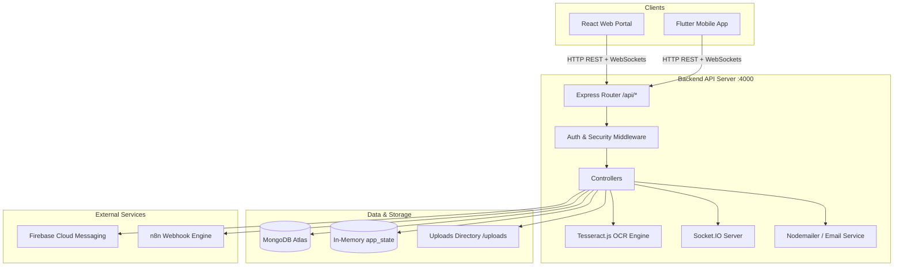

# STEP 1: REPOSITORY INVENTORY & SYSTEM DISCOVERY

**System Name**: Synertech ISKOLAR Scholarship Application System  
**Date**: August 1, 2026  
**Auditor**: Lead Full-Stack Architect & Security Auditor  

---

## 1. Repository Structure

```
iskolar-capstone-main/
├── backend/                        # Node.js / Express Backend API
│   ├── src/
│   │   ├── config/                 # Database & environment setup (db.js)
│   │   ├── controllers/            # Controller logic (auth, application, ocr, schedule, notification, verification, scholarship)
│   │   ├── middleware/             # Middleware (auth, audit, error, rate-limiting, sponsor verification)
│   │   ├── models/                 # Mongoose schemas (User, Student, Provider, Scholarship, Application, Notification, Schedule, AuditLog, ConsentRecord)
│   │   ├── routes/                 # Express route definitions (18 route modules)
│   │   ├── utils/                  # Helper utilities (emailService, notificationService, pushNotificationService, rankingUtils, ownership)
│   │   └── vercelApp.js            # Express application factory & Socket.IO server initialization
│   ├── server.js                   # Node.js HTTP server entry point (Port 4000)
│   ├── uploads/                    # Local document storage directory
│   ├── .env.example                # Environment variables template
│   └── package.json                # Dependencies & scripts
├── iskolar_admin_web/              # React / Vite / Tailwind Web Application (Provider & Admin Portal)
│   ├── src/
│   │   ├── components/             # React views (ApplicantsPage, ScholarshipsPage, DocumentVerificationPage, SchedulingPage, LoginModal, ProviderDashboard, etc.)
│   │   ├── App.jsx                 # Hash-router application entry point
│   │   └── main.jsx                # DOM mount entry
│   ├── index.html                  # HTML template
│   ├── vite.config.js              # Vite bundler config
│   └── package.json                # Web app dependencies & scripts
└── iskolar_mobile/                 # Flutter Mobile Application (Student & Sponsor Mobile Portal)
    ├── lib/
    │   ├── models/                 # Dart data models (user_model.dart, scholarship_model.dart, application_model.dart, document_model.dart)
    │   ├── screens/                # Mobile screens (login_screen.dart, mfa_verification_screen.dart, student_dashboard_screen.dart, browse_scholarships_screen.dart, ocr_review_screen.dart, etc.)
    │   ├── services/               # Mobile services (api_service.dart, auth_service.dart, socket_io_service.dart, firebase_push_service.dart, notification_service.dart)
    │   ├── utils/                  # Utilities (app_constants.dart, app_theme.dart, theme_provider.dart)
    │   ├── widgets/                # Reusable Flutter widgets (glass_card.dart, primary_button.dart, styled_text_field.dart)
    │   └── main.dart               # Flutter application entry point
    └── pubspec.yaml                # Flutter package dependencies
```

---

## 2. Detected Technology Stack

| Layer | Primary Technology | Version | Key Libraries |
|---|---|---|---|
| **Mobile App** | Flutter (Dart) | SDK ^3.0.0 | `provider`, `http`, `socket_io_client`, `firebase_messaging`, `firebase_core`, `shared_preferences`, `image_picker`, `google_fonts`, `sentry_flutter` |
| **Web App** | React + Vite | React 18, Vite 5 | `tailwindcss`, `framer-motion`, `lucide-react`, `socket.io-client` |
| **Backend API** | Node.js / Express | Node 18+, Express 4 | `mongoose`, `jsonwebtoken`, `bcrypt`, `multer`, `tesseract.js`, `nodemailer`, `socket.io`, `@sentry/node`, `express-rate-limit`, `exif-parser` |
| **Database** | MongoDB Atlas / Mongoose | Mongoose 8.x | Dual persistence: Mongoose Schemas + In-Memory `app_state` fallback (`db.data`) |
| **Real-Time** | Socket.IO | 4.x | Real-time WebSocket notifications & event rooms (`user_{id}`, `admin_room`) |
| **OCR Service** | Tesseract.js | 5.x | Client/Server side optical character recognition for government IDs & transcripts |
| **Push Notifications** | Firebase Cloud Messaging | Firebase Admin SDK | FCM multicast push service with fallback |
| **Email Delivery** | Nodemailer | 6.x | Gmail SMTP / Ethereal test account fallback |
| **Automation** | n8n Cloud Webhooks | HTTP Webhooks | Triggered on status updates & registration |

---

## 3. Applications and Responsibilities

1. **Student Mobile Application (`iskolar_mobile`)**
   - Student Registration & Email OTP Verification
   - Multi-Factor Authentication (MFA)
   - Profile Editing & Photo Upload
   - Government ID Verification Document Upload
   - Scholarship Grant Browsing & Searching
   - Scholarship Application Submission with Requirement Uploads
   - Tesseract.js OCR Field Extraction & Interactive Review
   - Application Status Tracking (Pending, Under Review, Approved, Rejected)
   - Exam & Interview Schedule Viewing
   - Real-Time Push & Socket.IO Notification Display

2. **Provider & Administrator Web Portal (`iskolar_admin_web`)**
   - Provider & Admin Authentication / Login with MFA OTP
   - Scholarship Grant Creation, Editing, & Requirement Configuration
   - Applicant Review Table with Dynamic Filtering & Scoring
   - Document Verification Interface with Image Preview & Status Controls (Verify, Reject, Request Resubmission)
   - Exam & Interview Scheduling Management
   - Application Decision Management (Approve / Reject) with Email/n8n Triggers
   - System Audit Log & Reports Review

3. **Backend API Server (`backend`)**
   - RESTful API endpoints under `/api/*`
   - JWT Auth & Token Verification Middleware
   - Rate Limiting Middleware
   - Data Access Layer connecting to MongoDB and `db.data` JSON store
   - File Upload Handling via Multer with validation
   - Tesseract.js OCR Execution & Verification
   - Socket.IO Real-time Room Management & Emitters
   - Notification Creation & FCM Dispatch

---

## 4. Available Scripts and Commands

### Backend (`backend/`)
- `npm run dev` — Starts dev server with nodemon (`server.js`) on port 4000
- `npm start` — Starts production server (`server.js`)
- `node scripts/test_routes.js` — Internal backend route smoke test

### Admin Web Portal (`iskolar_admin_web/`)
- `npm run dev` — Starts Vite dev server on port 5173
- `npm run build` — Builds production bundle to `dist/`
- `npm run preview` — Previews production build locally

### Mobile App (`iskolar_mobile/`)
- `flutter run` — Runs mobile app on device/emulator
- `flutter build apk` — Builds Android APK
- `flutter build web` — Builds Flutter web version

---

## 5. Existing External Services & Integrations

- **MongoDB Atlas**: Primary database via `MONGO_URI`
- **Nodemailer (Gmail/Ethereal)**: System transactional emails & OTP delivery
- **Firebase Admin & FCM**: Device push notification delivery
- **Tesseract.js**: Document OCR text extraction
- **n8n Webhook**: External workflow automation trigger (`N8N_WEBHOOK_URL`)
- **Sentry**: Application error logging and performance telemetry

---

## 6. Integration Architecture Map



---

## Stack Summary Confirmation

- **Architecture**: Unified 3-tier system (Flutter Mobile + React Web + Node/Express Backend + MongoDB Database)
- **Shared API Base**: `http://localhost:4000/api` (Web) / `http://10.0.2.2:4000/api` or `http://127.0.0.1:4000/api` (Mobile)
- **Status Alignment**: Unified statuses across mobile, backend, and web (`pending`, `approved`, `rejected`, `needs_resubmission`, `under_review`)
